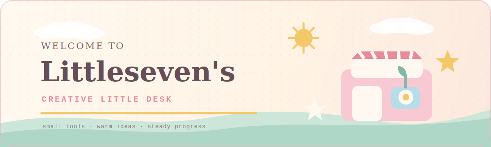
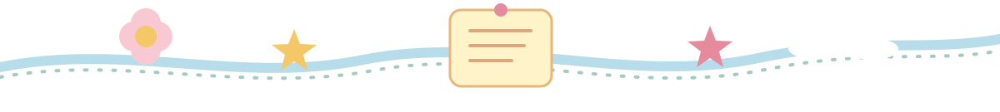
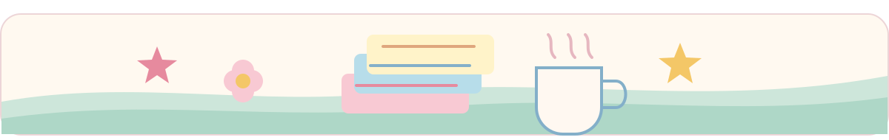

<div align="center">
  
</div>

<div align="center">
  <a href="https://git.io/typing-svg">
    
  </a>
</div>

<div align="center">
  
  
  
</div>

<br />

## About Me

你好，我是 **筱柒 Littleseven**。

我喜欢把日常中反复出现的小麻烦整理成可以运行的工具，也会记录一些自动化、数据分析和前端实验。这里像一张持续更新的书桌：有认真完成的小项目，也有刚刚写下的新想法。

```text
little desk
├── practical automation
├── lightweight web experiences
├── data analysis experiments
└── learning by building
```

<div align="center">
  
</div>

## Featured Projects

<table>
  <tr>
    <td width="50%" valign="top">
      <h3><a href="https://github.com/littleseven2003/homepage">homepage</a></h3>
      <p>一间慢慢布置的线上小屋。把内容、视觉与日常入口收拢到一处。</p>
      <sub>WEB EXPERIENCE · PERSONAL SPACE</sub>
    </td>
    <td width="50%" valign="top">
      <h3><a href="https://github.com/littleseven2003/mahjong_scoreboard">mahjong_scoreboard</a></h3>
      <p>为真实使用场景制作的轻量记分板，让牌局少一点手忙脚乱。</p>
      <sub>UTILITY · PRODUCT THINKING</sub>
    </td>
  </tr>
  <tr>
    <td width="50%" valign="top">
      <h3><a href="https://github.com/littleseven2003/WorkHoursTracker">WorkHoursTracker</a></h3>
      <p>围绕工时记录整理的小工具，把重复计算交给程序。</p>
      <sub>AUTOMATION · DAILY WORKFLOW</sub>
    </td>
    <td width="50%" valign="top">
      <h3><a href="https://github.com/littleseven2003/Overtime_Excel_Extractor">Overtime_Excel_Extractor</a></h3>
      <p>从表格中提取加班数据，让琐碎流程变成稳定步骤。</p>
      <sub>DATA · EXCEL · AUTOMATION</sub>
    </td>
  </tr>
</table>

## Currently Exploring

| 状态 | 正在做的事 |
| --- | --- |
| `building` | 把日常需求做成轻巧、顺手的小工具 |
| `observing` | 从已有软件与数据里寻找值得研究的问题 |
| `decorating` | 继续打磨个人主页与项目表达方式 |

## Activity

<div align="center">
  <picture>
    <source media="(prefers-color-scheme: dark)" srcset="https://github-profile-summary-cards.vercel.app/api/cards/profile-details?username=littleseven2003&theme=github_dark" />
    
  </picture>
  <br />
  <picture>
    <source media="(prefers-color-scheme: dark)" srcset="https://streak-stats.demolab.com?user=littleseven2003&hide_border=true&background=00000000&ring=9CCDBB&fire=F0A7B6&currStreakLabel=F6EAF0&sideLabels=F6EAF0&dates=B8A7AE&currStreakNum=F6EAF0&sideNums=F6EAF0" />
    
  </picture>
</div>

## Say Hello

<p>
  <a href="https://github.com/littleseven2003"></a>
  <a href="mailto:littleseven2003@126.com"></a>
</p>

<div align="center">
  
  <sub><samp>KEEP BUILDING · KEEP CURIOUS · TAKE IT EASY</samp></sub>
</div>

<!-- profile-readme-refresh: 2026-06-02 -->
